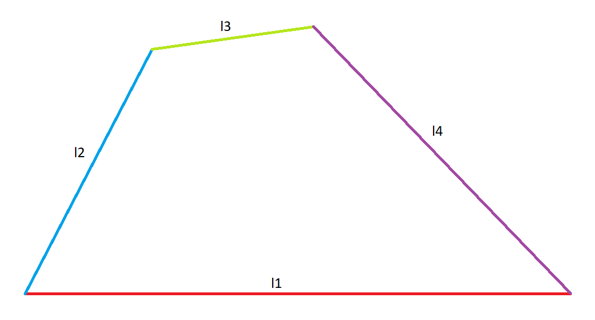

# DoubleRockerMechanism
Simulation of double rocker's mechanism using Python.

To run the simulation simply run the program and input valid link lengths and angular velocity.

Inputs of length should be in specific order (given in image below).

Input link is link 2
and output link is link 4
